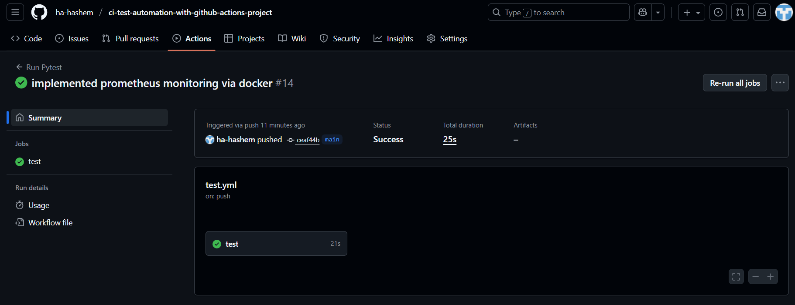

# Gold Price API Application


## Description
This application provides a FastAPI-based REST API for retrieving gold price data and currency conversion, with automated testing and monitoring. It is designed for CI/CD pipelines using GitHub Actions and includes integrations for Prometheus and Grafana monitoring.

## Getting Started

### 1. Clone the repository
```bash
git clone https://github.com/ha-hashem/ci-test-automation-with-github-actions-project.git
cd ci-test-automation-with-github-actions-project
```

### 2. Set up a Python virtual environment
```bash
python3 -m venv venv
source venv/bin/activate
```

### 3. Install dependencies
```bash
pip install -r requirements.txt
```

### 4. Register for GoldAPI.io
- Go to [https://www.goldapi.io/](https://www.goldapi.io/) and sign up for a free API key.
- Copy the API key from the dashboard.

### 5. Set up your API key
- Create a `.env` file in the project root:
	```
	GOLD_API_KEY=your_goldapi_key_here
	```
- **Do not commit your `.env` file.**
- Use the provided `.env.example` file as template

#### GitHub Actions
- In your GitHub repository, go to **Settings > Secrets and variables > Actions**.
- Add a new secret named `API_KEY` and paste your API key as the value.



### 6. Run the application locally
```bash
uvicorn app.main:app --reload
```
The API will be available at `http://127.0.0.1:8000`.

### 7. Run tests with pytest and coverage
```bash
pytest --cov=app
```

## Monitoring with Prometheus and Grafana

To launch Prometheus and Grafana using Docker Compose:

1. Ensure you have a `docker-compose.yml` file with Prometheus and Grafana services configured.
2. Start the services:
	 ```bash
	 docker-compose up -d
	 ```
3. Access Prometheus at `http://localhost:9090` and Grafana at `http://localhost:3000`.
4. Configure Grafana to use Prometheus as a data source and import dashboards as needed.

## Technologies Used

- [FastAPI](https://fastapi.tiangolo.com/) - Web framework for building APIs
- [pytest](https://docs.pytest.org/) - Testing framework
- [pytest-cov](https://pytest-cov.readthedocs.io/) - Coverage reporting for pytest
- [python-dotenv](https://github.com/theskumar/python-dotenv) - Loads environment variables from .env
- [httpx](https://www.python-httpx.org/) - Async HTTP client
- [Prometheus](https://prometheus.io/) - Monitoring and alerting toolkit
- [Grafana](https://grafana.com/) - Analytics and monitoring dashboard
- [Uvicorn](https://www.uvicorn.org/) - ASGI server for FastAPI

## Attributions

- FastAPI is developed by Sebastián Ramírez and contributors.
- pytest and pytest-cov are maintained by the pytest-dev team.
- python-dotenv is maintained by Saurabh Kumar and contributors.
- httpx is developed by Tom Christie and contributors.
- Prometheus and Grafana are open-source projects maintained by their respective communities.

See each project's documentation and license for more details.
